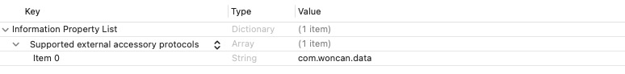
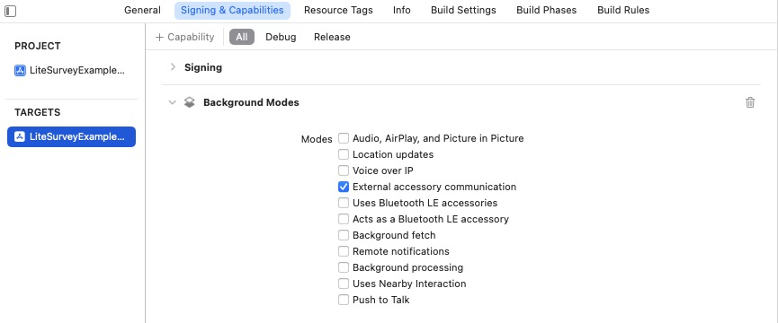

# LiteSurvey SDK Demo for iOS

This demo project shows how to use the LiteSurvey SDK to connect to Woncan LiteSurvey devices.

LiteSurvey SDK for iOS can connect to LiteSurvey devices and

- Output device data (location, satellite, etc.) to the application
- Configure device settings
- Perform device firmware upgrade
- and more

By integrating this SDK, you can support LiteSurvey device's high-accuracy position in your own app.

This SDK is also used in Woncan's official iOS app, LiteSurvey Pro.

## iOS system requirement

iOS 13.0 or above is required.

## How to use the SDK in your own app

### 1. Adding LiteSurvey as a dependency

**Method 1:  Swift Package Manager (Preferred)**

1.  Follow the instructions for
    [adding package dependencies to your app in Xcode](https://developer.apple.com/documentation/xcode/adding-package-dependencies-to-your-app).

2.  In the "Enter Package URL" field, enter this GitHub repository:

    ```
    https://github.com/WoncanHK/LiteSurveySDK-iOS
    ```

3.  Select the version of the LiteSurveySDK for iOS that you want to use. For new projects, we recommend specifying the latest version and using the "Exact Version" option.

**Method 2: Manual integration**

If you prefer not to use Swift Package Manager, you can integrate LiteSurvey into your project manually. The SDK framework file is available under "Releases".

You will need to Embed & Sign the LiteSurvey framework in the target settings of your app.

### 2. Configure info.plist

Add "com.woncan.data" as a supported external accessory protocol:



If device connection in background mode is desired, you may optionally add the "External accessory communication" Background mode under "Signing and Capabilities".



### 3. Import the Objective-C header

LiteSurvey SDK is written in Swift. For Swift projects, add `import LiteSurvey` to the top of your Swift file. For Objective-C projects, add `#import <LiteSurvey/LiteSurvey.h>`.

### 4. Scanning for devices

Use the `LiteSurveyDeviceScanner.shared.startScan` method to start scanning.

### 5. Receive device data (e.g. location)

When connecting to a device, register a delegate implementing the `LiteSurveyDeviceDelegate` interface to receive device data.

### Code example

The following code snippet is a minimal code example in Swift that

1. Scans for nearby LiteSurvey devices.
2. After connection, prints the location information reported by the device to debug output.

```Swift
class ViewController: UIViewController, LiteSurveyDeviceDelegate {
    
  override func viewDidLoad() {
        super.viewDidLoad()
  }

    //Scanning for LiteSurvey devices
    public func scan() {
        LiteSurveyDeviceScanner.shared.startScan(delegate: self)
    }

    // Receive Location delegate
    func didReceiveLocation(_ location: LiteSurveyLocationModel!) {
        print(location!)
    }
}
```

## Location information reported by the SDK

Location information is reported as the `LiteSurveyLocationModel` class. This class inherits from the system Location class [ `CLLocation`](https://developer.apple.com/documentation/corelocation/cllocation?language=objc#). Please see `LiteSurveyLocationModel` class definition for details.

Table: LiteSurvey SDK support for system `CLLocation` class parameters

|      Parameter      | Supported by LiteSurvey | Note                                          |
| :-----------------: | ----------------------- | --------------------------------------------- |
|     coordinate      | Yes                     |                                               |
|      altitude       | Yes                     |                                               |
| ellipsoidalAltitude | No                      | Use the custom property wgs84Altitude instead |
| horizontalAccuracy  | Yes                     |                                               |
|  verticalAccuracy   | Yes                     |                                               |
|       course        | Yes                     |                                               |
|   courseAccuracy    | No                      |                                               |
|        speed        | Yes                     |                                               |
|    speedAccuracy    | No                      |                                               |
|      timestamp      | Yes                     |                                               |
|        floor        | No                      |                                               |
|  sourceInformation  | Yes                     |                                               |

## Contact email

For technical or business inquiries, please contact support@woncan.com.hk
